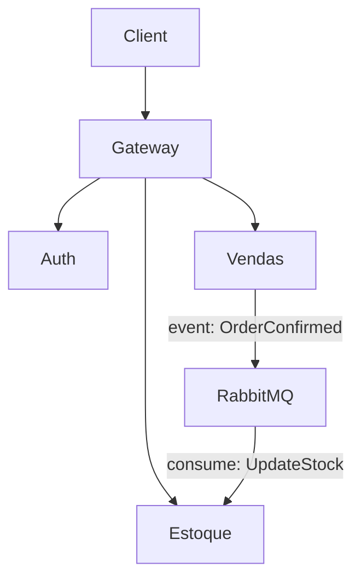

# 🛒 Avanade Microservices – E-commerce

Este projeto simula uma plataforma de **e-commerce** com **arquitetura de microserviços**, desenvolvida em **.NET 9 (C#)**.  
O sistema é composto por serviços independentes que se comunicam entre si para gerenciar **estoque, vendas, autenticação e roteamento via API Gateway**, utilizando **RabbitMQ** para mensageria e **JWT** para autenticação.

---

## 📐 Arquitetura

⚙️ Tecnologias Utilizadas
.NET 9 / C#
Entity Framework Core (ORM)
SQL Server (Banco de dados relacional)
RabbitMQ (Mensageria assíncrona)
JWT (JSON Web Token) (Autenticação e autorização)
API Gateway (YARP/Ocelot) (Roteamento centralizado)
Docker & Docker Compose (Orquestração de containers)

🚀 Funcionalidades

📦 Microserviço de Estoque
Cadastro de produtos (nome, descrição, preço, quantidade)
Consulta de produtos e estoque disponível
Atualização automática do estoque após vendas (via RabbitMQ)

💳 Microserviço de Vendas
Criação de pedidos com validação de estoque
Consulta de pedidos
Notificação de vendas para o serviço de estoque via RabbitMQ

🔑 Microserviço de Autenticação
Registro e login de usuários
Geração de tokens JWT para acesso seguro

🌐 API Gateway
Roteamento centralizado das requisições
Autenticação e autorização via JWT

🐳 Como Rodar com Docker Compose
Pré-requisitos
Docker

Docker Compose

Passo a passo: 
# Clone o repositório
git clone https://github.com/Matposs/avanade-microservices.git
cd avanade-microservices

# Suba os serviços
docker compose up -d
Acesse os serviços
Gateway: http://localhost:5000
Estoque: http://localhost:5001
Vendas: http://localhost:5002
Auth: http://localhost:5003
RabbitMQ Management: http://localhost:15672 (user: guest / pass: guest)

📌 Endpoints Principais
🔑 Auth
POST /auth/register → cria usuário
POST /auth/login → retorna JWT

📦 Estoque
POST /estoque/produtos → cadastra produto
GET /estoque/produtos → lista produtos

💳 Vendas
POST /vendas/pedidos → cria pedido
GET /vendas/pedidos/{id} → consulta pedido

🧪 Testes
Testes unitários básicos para cadastro de produtos e criação de pedidos.

Para rodar:
dotnet test
📊 Contexto do Negócio
A aplicação simula um sistema para uma plataforma de e-commerce, onde empresas precisam gerenciar estoque e realizar vendas de forma eficiente. A solução é escalável e robusta, com separação clara entre responsabilidades, seguindo boas práticas de arquitetura de microserviços.

Este tipo de sistema é comum em empresas que buscam flexibilidade e alta disponibilidade em ambientes com grande volume de transações.

✅ Critérios de Aceitação
Cadastro de produtos no microserviço de estoque
Criação de pedidos no microserviço de vendas, com validação de estoque
Comunicação eficiente entre microserviços via RabbitMQ
API Gateway centralizando as requisições
Autenticação segura via JWT
Código bem estruturado, com boas práticas de POO

🔮 Extras
Testes Unitários: para funcionalidades principais
Monitoramento e Logs: rastreamento de falhas e transações
Escalabilidade: possibilidade de adicionar novos microserviços (ex: pagamentos, envio)

👨‍💻 Autor
Projeto desenvolvido por Matheus Poss como estudo de arquitetura de microserviços em .NET e finalização do curso Avanade Backend+IA.